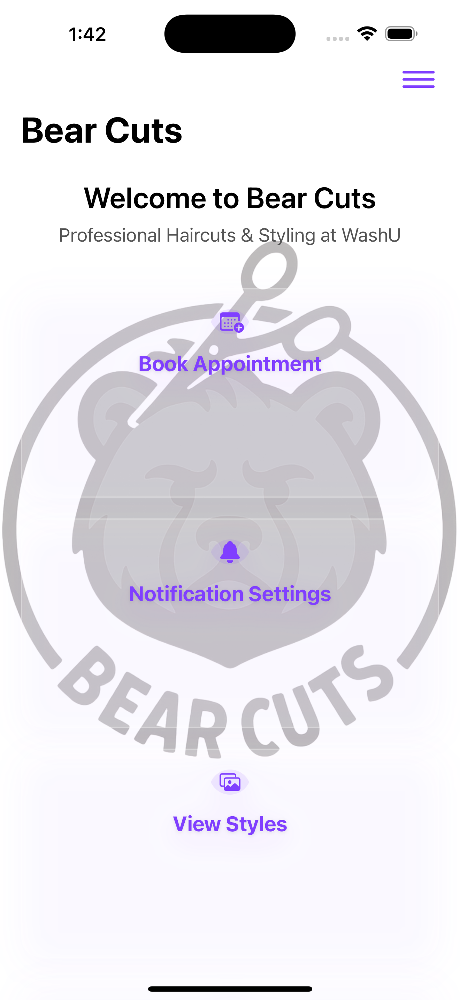
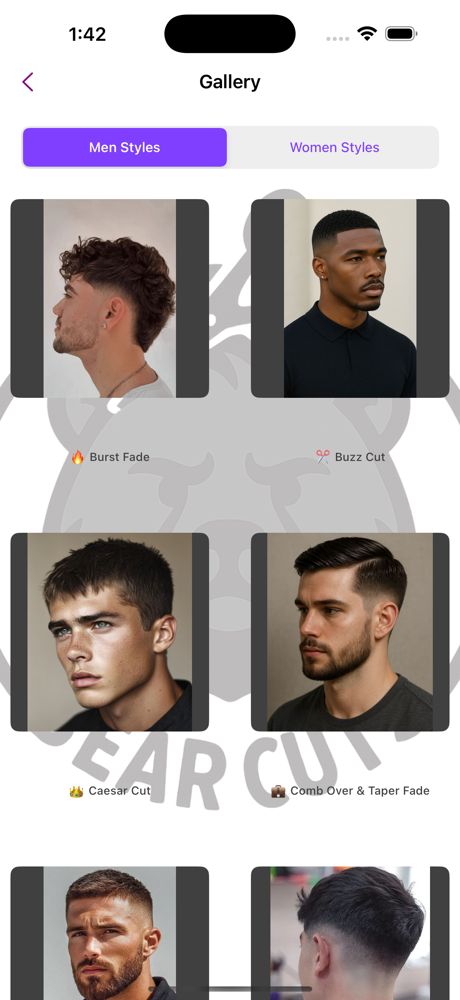
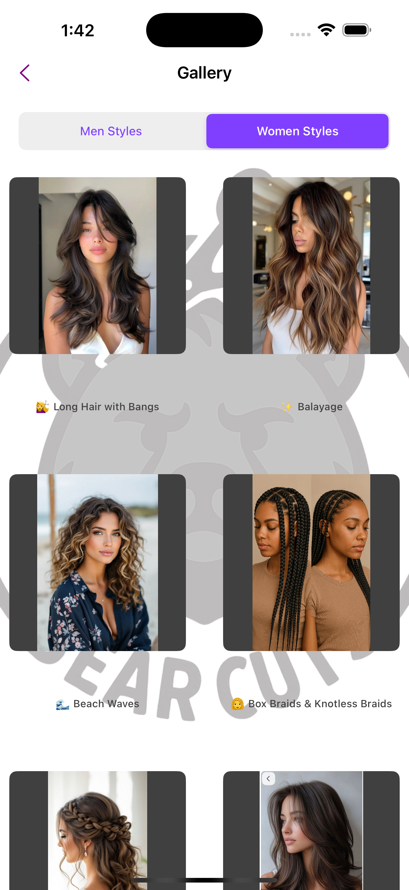

# Bear Cuts - Professional Barbershop Companion App

## Overview
Bear Cuts is a comprehensive iOS application designed specifically for Washington University students, providing a complete barbershop management experience. Built with Swift and UIKit, the app combines modern design principles with practical functionality to create an engaging user experience.

## 📱 Screenshots

<p float="left">
  
  
  
</p>

<p float="left">
  
  
  
</p>

## Features

### 🐻 Core Functionality
* **Smart Appointment Management** - Book appointments directly through integrated booking system
* **Personalized Reminder System** - Customizable notification timing (5 min to 2 hours before appointments)
* **Interactive Style Gallery** - Browse professional haircut styles with categorized collections
* **Location & Hours** - Real-time business information with integrated contact features

### 🔔 Advanced Notifications
* **Custom Reminder Timing** - Choose when to receive appointment reminders
* **Smart Notification Management** - Track seen/unseen reminders with visual indicators
* **Personal Reminder History** - Manage and organize your appointment reminders
* **Automatic Status Updates** - Intelligent sorting of active and completed reminders

### 🎨 Modern Design
* **Glassmorphism UI** - Premium iOS design with frosted glass effects
* **Responsive Layout** - Optimized for all iOS devices with smooth scrolling
* **Professional Aesthetics** - Clean, modern interface following iOS Human Interface Guidelines
* **Interactive Elements** - Engaging user experience with smooth animations

## Technical Specifications

### Development Stack
* **Language**: Swift 5.0+
* **Framework**: UIKit
* **Target Platform**: iOS 14.0+
* **Architecture**: MVC with programmatic UI

### Key Technologies
* **UserNotifications** - Local notification management
* **UserDefaults** - Persistent data storage
* **Auto Layout** - Responsive UI constraints
* **Core Graphics** - Custom drawing and effects

## Installation & Setup

### Requirements
* Xcode 13.0+
* iOS 14.0+ deployment target
* Swift 5.0+

### Build Instructions
1. Clone the repository
2. Open `willbarber.xcodeproj` in Xcode
3. Select your target device or simulator
4. Build and run the project

## Project Structure
```
willbarber/
├── HomeViewController.swift          # Main dashboard with glassmorphism cards
├── NotificationSettingsViewController.swift  # Reminder management system
├── GalleryViewController.swift       # Style browsing interface
├── LocationViewController.swift      # Business information display
├── AboutUsViewController.swift      # Company information and social links
├── BackgroundLogoView.swift         # Custom background logo component
└── Assets.xcassets/                 # App icons and visual resources
```

## Key Features Implementation

### Notification System
The app implements a comprehensive local notification system using `UNUserNotificationCenter`, allowing users to create personalized appointment reminders with custom timing options.

### Glassmorphism Design
Modern UI design featuring frosted glass effects, floating shadows, and subtle transparency to create a premium iOS experience.

### Data Persistence
Efficient data management using `UserDefaults` for storing user preferences and reminder data locally on the device.

## User Experience

### Target Audience
* Washington University students
* Local community members seeking professional haircut services
* Users who value convenience and appointment management

### User Benefits
* **Convenience** - Easy appointment booking and management
* **Reliability** - Never miss appointments with smart reminders
* **Professional Service** - Access to quality barbershop services
* **Modern Interface** - Engaging, intuitive user experience

## Business Value

### For Customers
* Streamlined appointment management
* Professional service access
* Convenient reminder system
* Modern, engaging interface

### For Business
* Enhanced customer engagement
* Improved appointment reliability
* Professional digital presence
* Customer relationship management

## Future Enhancements
* Push notification support
* Online payment integration
* Customer feedback system
* Loyalty program features
* Social media integration

## Contributing
This project was developed as a collaborative effort between Washington University students to create a practical solution for campus barbershop services.

## License
© 2024 Bear Cuts. All rights reserved.

## Contact
* **Instagram**: [@bearcuts_washu](https://www.instagram.com/bearcuts_washu)
* **Business**: Bear Cuts at Washington University
* **Location**: St. Louis, Missouri

---

**Built with ❤️ for the WashU community**
